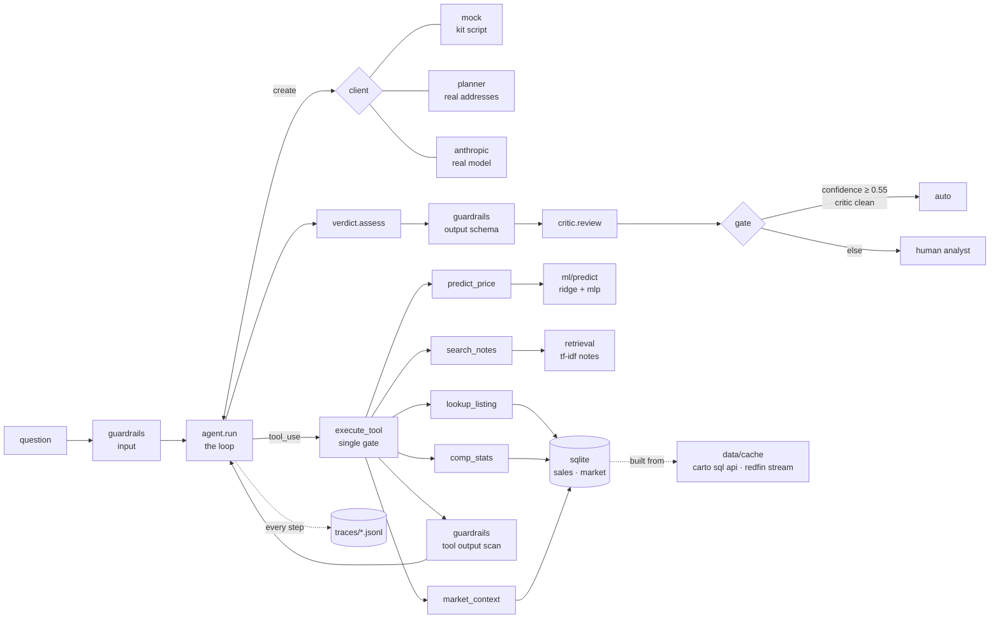

# bright-agent

**Is this home fairly priced?** An agent that answers with evidence — closed comps, market conditions, a model estimate — and knows when to hand the file to a human.

Built for the MLS subscriber's real question: a listing agent at the kitchen table needs a number they can defend, not a guess. The answer here is a verdict (`fairly_priced` / `overpriced` / `underpriced` / `insufficient_data`), a confidence, and the reasons written as numbers a broker can repeat.

```
$ python bright.py ask "Is 3358 Livingston St fairly priced?"

verdict engine: fairly priced (confidence 0.65)
  - list $190,000 vs comps median $182,500 (n=58, 12mo): +4.1%
  - size check: $215/sqft vs size-matched comps $149/sqft (k=32): +44.0%
  - model estimate $194,000 (ridge/mlp spread 6%): -2.1%
  - market: Philadelphia County, PA median dom 47 days, 4.4 months supply, balanced market -> tolerance band +/-5%
  - combined delta +1.5% vs band +/-5% -> fairly_priced (confidence 0.65)
route: auto - confidence above threshold and evidence complete
```

---

## The challenge, restated

Build an agent that answers "Is 123 Oak St fairly priced?" against a **deterministic mock LLM that cannot reason**. Tools implemented, loop working, errors handled, verdict defensible. Stdlib is fine. Scaffolding is what's graded.

The mock cannot reason, so the reasoning lives in code — where it can be read, tested and argued with. That constraint shaped everything below.

## What's here (60 seconds)

| Layer | Files | What it does |
|---|---|---|
| **Loop** | `agent.py` | The kit's contract: call model → dispatch tools → append results → repeat, capped at 10 turns. Plus tracing, guardrails, verdict, critic, gate. |
| **Tools** | `tools.py` | 5 tools behind one gate (`execute_tool`): errors come back as data, never exceptions. |
| **Data** | `data/` | Real public data via API → SQLite. Philadelphia recorded sales (Carto SQL API) + Redfin county market tracker (streamed gzip). |
| **ML** | `ml/` | Hedonic ridge (closed form) + one-hidden-layer MLP (hand-written backprop) on log price. PyTorch mirror and sklearn cross-checks. |
| **Verdict** | `verdict.py` | Two price votes + a size check + a market dial → verdict, confidence, reasons. |
| **Safety** | `guardrails.py`, `critic.py` | Input checks, prompt-injection scan on tool output, output schema check, rule-based critic (LLM-as-judge slot). |
| **Observability** | `tracing.py` | JSONL trace per run — every model call and tool call with latency. |
| **Evaluation** | `eval.py`, `tests/`, `ml/evaluate_models.py` | 12 scenarios scored on routing + verdict + gate; 38 unit tests (34 agent + 4 web); 5-fold model comparison. |
| **Retrieval** | `retrieval.py`, `notes/` | TF-IDF over method notes — the RAG seam. |
| **Clients** | `clients.py`, `mock_client.py` | Kit mock (untouched), deterministic planner for real addresses, Anthropic adapter. |
| **Web front** | `delphi/`, `render.yaml` | Delphi: a one-page Flask app for agents — price check, price ladder, market pulse, ask-the-method. Deploys to Render as one service. |

## Run it

```bash
python run.py                 # kit happy path (mock) — fairly priced, $415K vs $402.5K median
python run.py --broken        # kit broken path (unknown tool) — survives, routes to analyst
python eval.py                # 12 scenarios → scorecard
python -m unittest discover -s tests
python bright.py ask "Is 720 Shirley St fairly priced?" --price 499000 --dom 40
python bright.py trace traces/<run>.jsonl
pip install -r delphi/requirements.txt && python -m delphi.app   # delphi web front, http://127.0.0.1:8000
```

No installs for the loop, tools, data, verdict, eval. `numpy` for `ml/`. `scikit-learn`, `torch`, `anthropic` are optional and imported lazily.

The data snapshot is committed (`data/cache/`, 660 KB). To refresh from the live APIs: `python bright.py fetch` (Philadelphia: seconds; Redfin: a 240 MB stream, 2–4 minutes). `python bright.py train` refits the models.

## Architecture



One run, four turns with the planner: `lookup_listing` → (`comp_stats` + `market_context`) → (`predict_price` + `search_notes`) → end. The mock does two tool turns then answers; the verdict engine still runs on whatever evidence came back.

## Data: real, public, in the Bright footprint

**Recorded sales — City of Philadelphia OPA via the Carto SQL API.** Keyless, SQL on the wire: `data/fetch_philly.py` sends a `SELECT` with server-side casts and pages through the result. Filter: arm's-length residential sales (`sale_price > 50000`, single + multi family). Ordered by `md5(parcel||sale_date)` so any prefix of pages is a fair sample of the window. The committed snapshot is 2,000 sales from a 12-month window of 11,500 (latest recorded sale 2026-08-26).

**Market indicators — Redfin Data Center county tracker.** `data/fetch_redfin.py` opens the national gzip over HTTP and filters it line by line — constant memory, never on disk. 13 Bright-footprint counties, monthly, since 2023. Philadelphia County, May 2026: median DOM 47, 4.4 months of supply, 5,384 active listings.

**Two things you should know.** Recorded sales lag closings by 4–8 weeks, so the last two months are thin (the agent drops a partial month before reading a trend). And this is not MLS data: no list prices, no DOM per listing. The agent uses the last recorded sale as the price on the table unless you pass `--price`, and the county median DOM unless you pass `--dom`. Provenance with timestamps and hashes: `data/cache/provenance.json`.

**SQL where it belongs.** `data/store.py` computes the comps median with a window function (`ROW_NUMBER() OVER (ORDER BY sale_price)`), the same idiom you'd write on Redshift. Size-matched $/sqft, partial-month detection and the training filter are queries too.

## The verdict, defended

Two votes, one check, one dial:

- **Comps vote** — list price vs the median of same-zip, same-beds sales in the last 12 months. Weight grows with comp count, saturating at 12.
- **Model vote** — list price vs the ridge/MLP blend. Weight 0.8 if the zip was in training, discounted by the spread between the two models.
- **Size check** — $/sqft vs size-matched comps (0.7×–1.3× the subject's sqft). Small homes carry a high $/sqft by nature, so this lowers *confidence* when it disagrees; it never moves the price.
- **Market dial** — ±5% band in a balanced market, ±7% in a sellers' market (<4 months supply), ±3% in a buyers' market (>6). A listing whose DOM is >1.5× the market median gets a +2pt nudge toward overpriced.

Each vote is clipped at ±50% so one wild number cannot run the show. Confidence = evidence volume × agreement × margin from the line. Below 0.55, no call is issued — the file routes to an analyst with the numbers attached. The critic then reads the verdict against the raw evidence (every dollar figure traceable, direction matches the delta, confidence not high on thin comps) and can also route to a human.

## Models: measured on 5 folds, same features, same rows

| model | r²(log) | MAPE | median \|err\| | within 10% |
|---|---|---|---|---|
| zip median (broker's back-of-envelope) | 0.336 | 0.480 | 0.303 | 18.6% |
| city assessor's value, as-is | 0.604 | 0.293 | 0.170 | 33.0% |
| **ridge, ours** (closed form) | **0.627** | 0.309 | 0.199 | 27.2% |
| **mlp, ours** (numpy, hand backprop) | 0.621 | 0.319 | 0.203 | 26.1% |
| sklearn ridge (same features) | 0.627 | 0.309 | 0.199 | 27.2% |
| sklearn gradient boosting | 0.641 | 0.308 | 0.193 | 28.8% |
| torch mlp (same architecture) | 0.619 | 0.322 | 0.199 | 28.0% |

Three things this table says. Our closed-form ridge matches sklearn to the third decimal — the implementation is right. Our numpy network matches the torch network — the backprop is right (`ml/mlp_numpy.py:gradient_check` proves it independently, max relative error 3e-9). And on 2,000 rows the hidden layer buys nothing over the line; gradient boosting edges ahead. The assessor's number is a strong feature (it is public for every parcel) and the model beats the assessor alone. More rows will move the MLP; the fetch is one command.

## Evaluation: 12 scenarios, three axes each

Every scenario is scored on **routing** (which tools ran), **verdict**, and **gate** (auto vs analyst). All twelve pass; `python eval.py` prints the scorecard and writes `traces/eval_latest.json`.

```
mock happy path                    fairly_priced   auto      3 turns
mock broken path (unknown tool)    insufficient    analyst   error returned as data
planner: sold at comps median      fairly_priced   auto      4 turns, 5 tools
planner: asking 30% over           overpriced      auto
planner: asking 20% under          underpriced     auto
planner: stale listing (dom 120)   overpriced      auto      dom nudge in reasons
planner: flip sold 2x comps        overpriced      auto
planner: unknown address           insufficient    analyst   stops after 2 turns
guardrail: injection in tool output  redacted before the model sees it; verdict still computed
guardrail: runaway loop            cap at 10 turns, routed to analyst
guardrail: injection in question   blocked at input
guardrail: absurd price            blocked at input
```

Failure is designed, not accidental: the unknown tool, the missing address, the runaway client and the poisoned listing remark each have a scenario and a specific expected behaviour.

## Choices, and why

**Stdlib loop, no framework.** The contract is 20 lines. A framework would hide the two things the challenge grades — the dispatch gate and the message shape — behind abstractions. When a graph earns its place (branching plans, retries with state, parallel sub-agents that need checkpointing), `agent.run` is the node body and LangGraph is the wrapper; nothing in `tools.py` or `verdict.py` changes.

**The verdict is code, not prose.** The mock cannot reason; a real model can, but a pricing call that lives in a prompt cannot be unit-tested or explained to a regulator. `verdict.assess` is 100 lines with tests. The model narrates; the engine decides.

**Real data, cached snapshot.** A committed 660 KB snapshot means `python run.py` works on a fresh clone, offline. The fetchers reproduce it exactly (deterministic ordering, hashes in provenance) and scale it up on demand.

**Two models on purpose.** The ridge is the explainable baseline (coefficients in log-price units are percentages). The MLP is the same features through one hidden layer. Their *disagreement* is a signal the verdict uses to discount the model vote — an ensemble that reports its own uncertainty.

**Planner client instead of a second mock.** Real addresses need the same loop with different tool arguments. A rule-based planner reads the transcript like a model would and picks the next tool. It cannot reason either — which is the point: the scaffold is proven on real data before a key is ever needed. `--client real` swaps in the Anthropic adapter; the loop does not change.

## Where the JD's stack plugs in

- **Bedrock / AgentCore**: `clients.AnthropicClient` becomes `AnthropicBedrock` (same SDK, SigV4 auth, `anthropic_version: bedrock-2023-05-31`); `execute_tool` is the action group; `traces/` is what CloudWatch ingests.
- **LangGraph**: one node per step of the planner, `evidence` as graph state, the gate as a conditional edge.
- **MCP**: `TOOL_SCHEMAS` are already JSON schema; an MCP server exposes the same five tools to any client.
- **Vector DB / RAG**: `retrieval.Index.embed` → an embedding call; the dict store → Pinecone/Qdrant/pgvector. `search_notes` keeps its contract.
- **LangSmith / Langfuse / Phoenix**: the JSONL events map one-to-one onto their span model (run → trace, model_call/tool_call → spans).
- **Guardrails AI / NeMo**: `guardrails.py` is the policy; those libraries are the enforcement runtime.
- **DSPy**: the planner's decisions and the critic's rubric are the two prompts worth optimising once a real model is in the loop; `eval.py` is the metric.
- **A/B testing**: `eval.py` runs the same scenarios against any client — mock, planner, real — and diffs the scorecards.

## Limits (say them before they're asked)

- Comps are zip + beds. A real appraisal adjusts for condition, lot, garage and distance; `lat`/`lng` are in the store for a radius-based upgrade.
- 2,000 training rows. The MLP is under-fed; the assessor's value carries much of the model's accuracy.
- Public records, not MLS: no list price, no listing DOM, no status history. The `--price` / `--dom` overrides are the seam for a live feed.
- The county market dial is coarse; zip-level Redfin data exists (1.5 GB stream) and slots into the same table.
- Confidence is a calibrated heuristic, not a probability. Calibrating it against realised sale-to-list outcomes is the first thing to do with MLS data.

## Layout

```
bright-agent/
├── run.py            kit entry (unchanged)          ├── data/
├── agent.py          the loop                       │   ├── fetch_philly.py   carto sql api → pages
├── tools.py          schemas + bodies + gate        │   ├── fetch_redfin.py   gzip stream → filter
├── clients.py        mock · planner · anthropic     │   ├── store.py          sqlite + the queries
├── mock_client.py    kit mock (unchanged)           │   └── cache/            snapshot + provenance
├── verdict.py        evidence → call                ├── ml/
├── guardrails.py     input · tool output · schema   │   ├── features.py       record → vector
├── critic.py         second pair of eyes            │   ├── linear.py         ridge, closed form
├── tracing.py        jsonl tracer                   │   ├── mlp_numpy.py      backprop by hand
├── retrieval.py      tf-idf rag seam                │   ├── mlp_torch.py      autograd twin
├── eval.py           scenario harness               │   ├── train.py · predict.py · evaluate_models.py
├── bright.py         cli                            │   └── artifacts/        model.json · eval_results.json
├── notes/            method notes (rag corpus)      ├── tests/                38 unit tests
├── render.yaml       render blueprint for delphi    └── delphi/               flask web front (app.py, templates/, static/)
```
