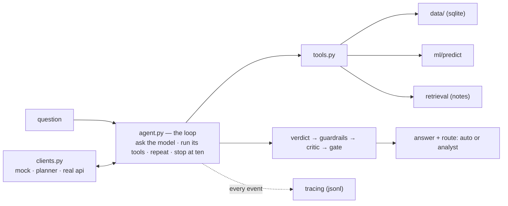

# bright-agent

## Problem Framing - I ran this like a sprint, one user, one job, and a definition of "done":  

- **User story** - As a listing agent, I need to tell a seller what their house is worth with composure and confidence driven by market-tested statistics.  

- **Today - The Challenge** - Complete a comparative market analysis (CMA) by hand: pull comps, adjust for differences, and write up the number. The goal is to submit a price the seller accepts AND the market supports.  

- **What I built** - An assistant that builds the analysis, balances speed with precision, and shows its work: 
    + comparable sales
    + a market read
    + a model estimate
    + a verdict with a confidence
    + a human analyst for anything uncertain  

- **At a Glance - Example** - "Is 720 Shirley St. fairly priced at $499,000"? ->  property record, six comparable sales, county market, model estimate -> fairly priced -> confidence 0.62, cleared for auto, every number listed, run logged. An unknown address stops in two turns and goes to an analyst. (NB: 720 Shirley St. is in Philly, zip 19130; a real house that sold for $526,000 in March 2026.)

---  

## Layout

``` 
bright-agent/
|-- run.py, mock_client.py      -  the two scripted runs and the mock model behind them
|-- agent.py                    -  the agent loop
|-- tools.py                    -  the five things the loop can do
|-- verdict.py                  -  turns the evidence into a verdict and a confidence
|-- guardrails.py, critic.py    -  safety checks, and a second reader for the numbers
|-- tracing.py, eval.py         -  the run log, and the 12-scenario scorecard
|-- retrieval.py, notes/        -  search over the method notes
|-- bright.py                   - the command line
|-- data/
|   |-- fetch_philly.py         - city sales, pulled with sql over http
|   |-- fetch_redfin.py         - county market file, streamed
|   |-- store.py                - sqlite and its queries
|   |--cache/                   - the snapshot + provenance
|-- ml/
|   |--features.py              - record -> numbers
|   |--linear.py                - ridge regression
|   |--mlp_numpy.py             - small neural net by hand
|   |--mlp_torch.py             - same net in pytorch
|   |--train.py, predict.py, evaluate_models.py
|   |--artifacts/               - the trained model, the cross-validation results
|--tests/                       - 38 unit tests
|--delphi/                      - the web page for agents
```   
---   

## Architecture



Three layers - above the loop sits the things that decie the next move: the mock, a rule-based planner, or the real model; the loop cannot tell them apart. The loop itself only keeps the transcript, runs the requested tools, and logs every step. 

Below it, five tools do the actual work against sqlite, the trained moels and the method notes. When the loop ends, the verdict is computed from the evidence the tools returned - the model narrates - it doesn't decide - then checked, read by the critic, and routed to auto or to a human analyst
---  

 ## The data

 Two public sources, no keys, both re-pullable with one command ('python bright.py fetch'):
 - **City of Philadelphia sales** - recorded deeds from the assessor's open-data API. the endpoint takes a plain sql query over the web; 2,000 sales are cached in the repo with a checksum ( aka fingerprint of a file; proves the cached data wasn't altered). Ground truth for comps and for training.  
 - **Redfin county market tracker** - one big national file, streamed line by line; I keep 13 Bright-footprint counties. Days on market, months of supply - together a simplified read on the market's pulse.

Limitation: this is deed and county data, not MLS data. There are no list prices or days on market per listing, so those are inputs ('--price', '--dom'). In production that gap is one join to a live listing table.

## Choices, in the order I made them  

1. **Start with a mock model** - scripted the model's turns, so every run gives the same answer; that let me test the loop, the tools and the error handling on their own, before a real model came in.  

2. **A standard loop, no framework** - ask the model what to do, run the tools it asks for, hand back the results, repeat, stop at ten turns. Frameworks do this same thing under the hood; writing it myself keeps every step visibile.  

3. **The verdict is computed, not generated** - the comps and the price model each give a signal, the markets sets how much tolerance we allow, and simple arithmetic combines them. The language model only writes the explanation - it has no say in the number.  

4. **Real data instead of synthetic** - Philly deed records and Redfin county files are public, checkable, and in Bright's territory. Synthetic data would have hidden the real problems including (but not limited to): missing bedroom counts, $1 family transfers, half-reported months.  

5. **Two price models on purpose** - a ridge regression I can read line by line, and a small neural net that picks up what the line misses. When the two disagree, confidence goes down - that disagreement is useful information.  

6. **A rule-based planner instead of a second mock** - it walks real addresses through all five tools, the same way every time, no api key needed; it can't reason, and that is fine -- swapping in the real model is just a several-lines change.  

---  

 # The models

 Both predict the log of the sale price from 58 property features - size, age, condition, building type, zip, and the city assessor's own valuation. I compared them against practical baselines on five cross-validation folds, split by property so a house that sold twice never appears on both sides.

| model | r^2 (log) | median error |
|---|---|---|
| zip median (back-of-envelope) | 0.34 | 30% |
| city assessor's value , as-is | 0.60 | 17% |
| ridge regression (mine) | 0.63 | 20% |
| neural net (mine, numpy) |0.62 | 20% |
| scikit-learn ridge | 0.63 | 20% |
| gradient boosting | 0.64 | 19% |
| pytorch net (same design) | 0.62 | 20% |

Three things this table tells me:  

1. My ride matches sckikit-learn's to the third decimal, so the closed-form math is correct.  

2. My numpy net lands where the pytorch net lands, so the hand-written gradients are right - a finite-difference check confirms them independently.  

3. And on 2,000 rows the extra flexibility buys little: gradient boosting edges ahead, and I say so rather than hide it.

---  

## Run it

```bash
python run.py                    # scripted happy path - fairly priced, confidence 0.58
python run.py --broken           # a tool fails mid-run; the assistant reports it and routes to an analyst
python -m unittest discover -s tests
python eval.py                   # the 12-scenario scorecard
python bright.py ask "Is 720 Shirley St fairly priced?" --price 499000 --dom 40
python bright.py trace traces/<file from the run above>
pip install -r delphi/requirements.txt && python -m delphi.app   # delphi web front, http://127.0.0.1:8000
```

Nothing to install for the loop, tools, verdict or evaluation — standard library only. The models need `numpy`; the web front needs `flask`.

---  

## Evaluation 

Twelve scripted scenarios, each scored three ways:  

- which tools ran, what verdict came out, and wether it was cleared or sent to an analyst;  

- the set covers the happy path, a failing tool, clear overpricing and underpricing, a stale listing, an unknown address, a runaway model that keeps asking for tools, and two poisoned inputs that must be blocked before the loop starts;  

- all twelve pass, the scorecard is saved to a file, and 38 unit tests sit underneath.

---  

## Limitations

1. This is deed and county data, not MLS data - no list prices or days on market per listing, so those come in as inputs. 

2. Two thousand sales is enough to prove teh pipeline, not to ship the model; one command pulls the full year. 

3. The rule-based planner cannot reason; the real-model adapter exists and is small. 

4. The text scan for prompt injection catches known phrasing, not paraphrase - the deeper defense is that the model never makes the pricing call. And the market bands are broker rules of thumb, labeled as such.